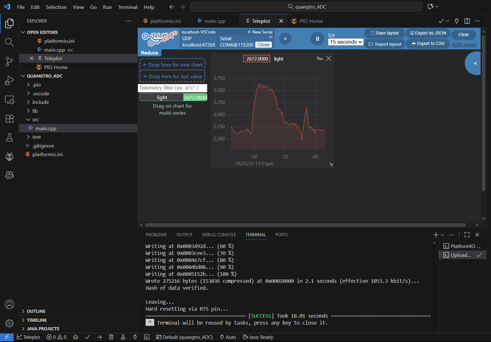

#  ESP32 LDR Light Sensor – Teleplot 

##  Giới thiệu
Dự án này được thực hiện nhằm **kiểm tra hoạt động của quang trở (LDR)** trên vi điều khiển **ESP32**, 
đồng thời **hiển thị đồ thị cường độ ánh sáng theo thời gian thực** bằng công cụ [Teleplot](https://marketplace.visualstudio.com/items?itemName=alexnesnes.teleplot).

Dự án được phát triển trên **PlatformIO (VS Code)** với mục tiêu giúp hiểu rõ nguyên lý đọc tín hiệu ADC, 
chuyển đổi tương tự – số và hiển thị dữ liệu cảm biến một cách trực quan.

---

##  **Chức năng chính**
- Đọc giá trị ánh sáng (0–4095) từ cảm biến quang trở (LDR) qua kênh ADC của ESP32  
- Gửi dữ liệu qua cổng UART để **Teleplot** hiển thị dạng đồ thị  
- Theo dõi sự thay đổi độ sáng theo thời gian thực  
- Có thể mở rộng để điều khiển thiết bị (ví dụ bật/tắt đèn tự động)

--- 

Hình ảnh minh họa kết quả thực nghiệm hiển thị trên Teleplot:

Tác giả: **Lê Thanh Tùng**  
GitHub: [https://github.com/lethanhtung0711/Quangtro_ADC](https://github.com/lethanhtung0711/Quangtro_ADC)
